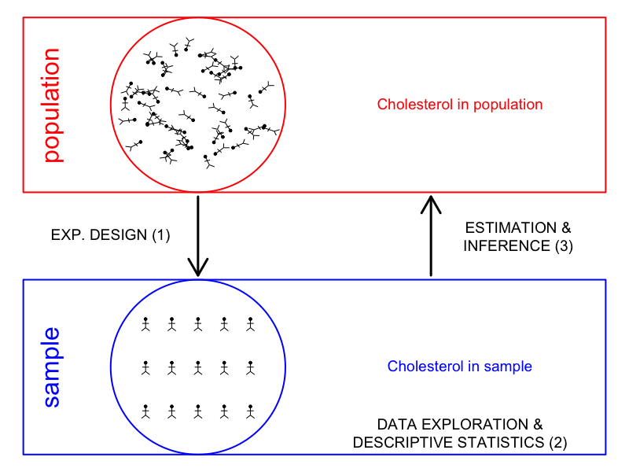

## Course Description

This intermediate level course is one of our Foundations courses. It covers essential statistical concepts and methods for extracting insights from empirical data in the life sciences. The course positions applied statistics, starting from important aspects of experimental design and data exploration. We then move into statistical modeling and data analysis. We will focus on the link between linear regression and analysis of variance. Together, these methods contribute to the study of General Linear Models. The course also introduces the basics of non-parametric testing, and addresses categorical data analysis and logistic regression.

The concepts and methods are exclusively introduced via case-studies in the life sciences. For every study we elaborate on a concrete research question and then provide a study design, which is followed by data exploration. Next, we will focus on how to model the data and elaborate on the link between model parameters and the subject matter research question.

---

### Learning objectives

The case studies will enable the participants to build self-confidence in
understanding, reading and communicating on data and data analysis
selecting appropriate statistical methods and software tools for analysing different types of data
interpreting the result of a statistical data analysis in terms of subject matter research questions and reporting them appropriately.

There is a strong emphasis in reproducible research by extensively using R/Rmarkdown scripts. This approach will enable the participants to weave statistical analyses, code, results and interpretation in webpages and PDF documents so that their entire data analysis workflow is transparent and reproducible. The course materials are designed in R/Rmarkdown, kickstarting the course participants into developing their own scripts.

---

### Practical Statistics for the Life Sciences

#### Software

- The learning materials are developed for [R](https://www.r-project.org/) version 3.6.0 or later. We also recommend to also install the latest version of [RStudio](https://www.rstudio.com/products/rstudio/download/).

- To install all requirements, please copy and paste this line of code in your R console.

```
source("https://raw.githubusercontent.com/GTPB/PSLS20/master/install.R")
```

- Alternatively, learners can launch an R studio interface in the cloud.

[](https://mybinder.org/v2/gh/GTPB/PSLS20/binderR?urlpath=rstudio)

- To get familiar with most important concepts in working with R and Rmarkdown, you may download the respective cheat sheets:
https://raw.githubusercontent.com/GTPB/PSLS20/master/background_material/r-cheatsheet.pdf
and https://raw.githubusercontent.com/GTPB/PSLS20/master/background_material/rmarkdown-cheatsheet.pdf

- All data can be downloaded locally through
[data](assets/data.zip)


#### Learning materials

1. [Introduction](pages/01-intro.html)
2. [Concepts](pages/02-concepts.html)
3. [Experimental Design](pages/03-experimentalDesign.html)
4. [Data Exploration](pages/04-dataExploration.html)
    - [Tutorial](pages/04_dataExploration.md)
5. Statistical Inference
    - [5.1. Statistical Inference](pages/05-statisticalInference.html)
    - [5.2. Two-sample t-test](pages/05-statisticalInference-twosampleT.html)
    - [Tutorial](pages/05_statisticlInference.md)
6. [Linear Regression](pages/06-linearRegression/06-linearRegression.html)
    - [Tutorial](pages/06-linearRegression/06_linearRegression.md)
7. [Analysis of Variance](pages/07-ANOVA/07-Anova.html)
    - [Tutorial](pages/07-ANOVA/07_ANOVA.md)
8. [Multiple Regression](pages/08-multipleRegression/08-MultipleRegression.html)
    - [Tutorial](pages/08-multipleRegression/08_multipleRegression.md)
9. Nonparametric Statistics:
    - [9.1 Nonparametric Statistics: Wilcoxon-Mann-Whitney test](pages/09-Non-parametric/09-NonparametericStatistics-WilcoxonMannWhitney.html)
    - [9.2 Nonparametric Statistics: Kruskal Wallis test](pages/09-Non-parametric/09-NonparametericStatistics-KruskalWallis.html)
    - [Tutorial](pages/09-Non-parametric/09_kruskalWallis.md)
10. [Categorical Data Analysis](pages/10-categoricalAnalysis/10-categoricalDataAnalysis.html)
      - [Tutorial](pages/10-categoricalAnalysis/10-categoricalAnalysis.md)

---


### [Instructors](pages/instructors.md)


---

The source for this course webpage is [in github](https://github.com/GTPB/PSLS20).

<br/>

<a rel="license" href="http://creativecommons.org/licenses/by/4.0/"></a><br /><span xmlns:dct="http://purl.org/dc/terms/" property="dct:title">PSLS20</span> by <span xmlns:cc="http://creativecommons.org/ns#" property="cc:attributionName">GTPB</span> is licensed under a <a rel="license" href="http://creativecommons.org/licenses/by/4.0/">Creative Commons Attribution 4.0 International License</a>.
