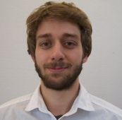

## Lieven Clement
**Affiliation**: Department of Applied Mathematics, Computer Science and Statistics, Ghent University, Ghent, BE

**Lieven Clement** is an Associate Professor of Statistical Genomics at Ghent University. He is an expert in developing statistical methods and open source tools for differential omics data analysis. His research efforts resulted in numerous publications on novel methods and tools for, and applied research in omics data analysis.

His lab is built around three strategic research pillars each connected to an omics domain: metagenomics, transcriptomics and proteomics and he also has a strong interest in leveraging his expertise to translational research.

He also serves as a member of the core team that established a new Master of Science in Bioinformatics at Ghent University, as a board member of the Belgian Proteomics Association, as an expert in genomics projects of the Belgian Health Care Knowledge Center (KCE), and as an Associate Editor for the journal Biometrics (2011-2017).

## Jeroen Gilis
**Affiliation**: Department of Applied Mathematics, Computer Science and Statistics, Ghent University, Ghent, BE
Jeroen Gilis is a PhD student in the statOmics Group at Ghent University, headed by prof. Lieven Clement. After completing a bachelor's and master's degree in biochemistry and biotechnology at KU Leuven, he obtained an additional master's degree in bioinformatics at Ghent University. During his master thesis at the statistical omics group, he has worked on developing novel, scalable tools for studying differential expression in single-cell transcriptomics applications. Jeroen is currently continuing his research as a PhD student in the group.

 

### Back

Back to [main page](../index.md).
